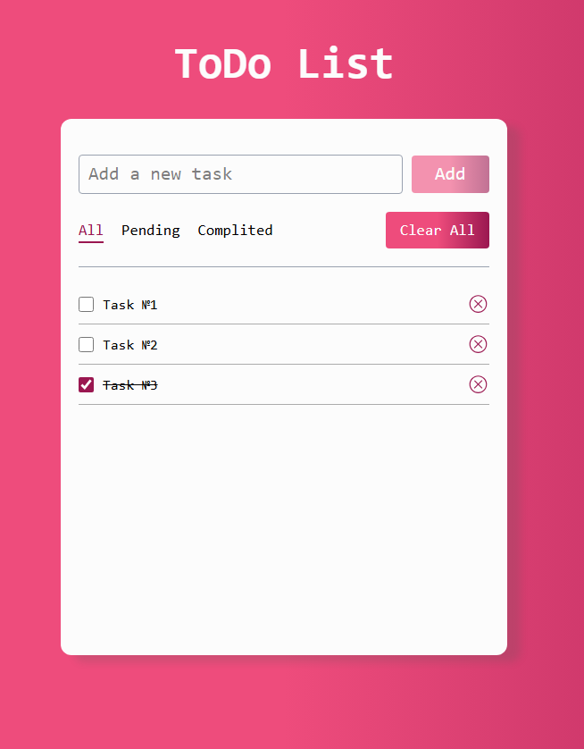

# 📝 Todo List App

A modern task management application built with TypeScript and Tailwind CSS.



## ✨ Features

- ✅ Add, edit and delete tasks
- ✅ Mark tasks as completed
- ✅ Filter tasks: All, Active, Completed
- ✅ Clear all tasks
- ✅ Data saved in Local Storage
- ✅ Fully responsive design
- ✅ Clean TypeScript architecture

## 🛠 Technologies

- **TypeScript** - type safety and code reliability
- **HTML5** - semantic markup
- **Tailwind CSS** - modern styling
- **SortableJS** - drag & drop functionality
- **Local Storage API** - data persistence

## 🚀 Getting Started

1. **Clone the repository:**
```bash
git clone https://github.com/Ll1235/todo-list.git
cd todo-list 
```

2. **Install dependencies:**
```bash
npm install
```

3. **Compile TypeScript (in first terminal):**
```bash
tsc --watch
```

4. **Build Tailwind CSS (in second terminal):**
```bash
tailwindcss -i input.css -o output.css --watch
```

5. **Open index.html in your browser:**
Find index.html file in project folder
Double-click it or open with your browser
